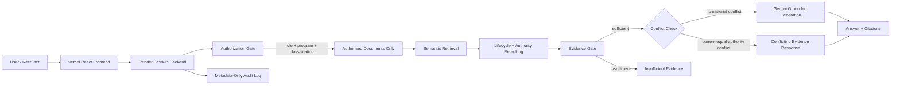

# Engineering Knowledge Copilot

A permission-aware Retrieval-Augmented Generation (RAG) system for engineering and hardware program knowledge.

**Live demo:** https://engineering-knowledge-copilot-front.vercel.app  
**Backend health:** https://engineering-knowledge-copilot-backend.onrender.com/api/health

> **Portfolio note:** the public deployment uses synthetic data only. It does not contain real employer, customer, supplier, or confidential company information.

---

## Why this project exists

Engineering programs generate critical knowledge across requirements, validation reports, Jira tickets, engineering change requests, PLM records, supplier notes, lessons learned, and financial documents.

A normal chatbot can retrieve relevant text, but enterprise engineering knowledge also requires deterministic answers to questions like:

- Is the user allowed to see this document?
- Is the source current or superseded?
- Which source has greater authority?
- What happens when two authoritative records conflict?
- When should the system refuse to answer?
- Can every answer be traced back to evidence?

Engineering Knowledge Copilot was designed around those constraints rather than treating them as afterthoughts.

---

## What the system demonstrates

- **Permission-aware retrieval** using role, assigned program, and document classification
- **Authorization before semantic ranking** so unauthorized documents never enter the retrieval candidate set
- **Grounded answers with citations**
- **Evidence sufficiency gating** before generation
- **Conflict detection** for current, equal-authority specifications
- **Lifecycle awareness** for current vs. superseded records
- **Source-authority-aware reranking**
- **Prompt-injection resistance** by treating retrieved evidence as untrusted content
- **Privacy-preserving activity logging** without raw question or answer text
- **Public-demo abuse controls** including request-size and rate limits
- **Synthetic multi-program corpus** spanning automotive and consumer hardware scenarios
- **Evaluation coverage** for grounding, permission boundaries, refusals, citation recall, conflicts, and leakage

---

## Live architecture



### Request path

1. The user selects a demo persona and repository.
2. The backend resolves the persona's role, assigned programs, and clearance.
3. Unauthorized documents are filtered **before** semantic retrieval.
4. Authorized chunks are ranked with cosine similarity.
5. Document status and authority provide bounded reranking adjustments.
6. The evidence gate checks relevance and coverage.
7. Deterministic conflict handling runs before generation.
8. If the evidence is acceptable, Gemini receives only authorized evidence.
9. The response is returned with citations and diagnostics.
10. Operational metadata is logged without storing raw prompt/answer content.

---

## Public demo

The public deployment intentionally uses a self-contained repository:

- **50 synthetic documents**
- packaged local embedding index
- simulated personas
- no public Google Drive OAuth
- no live write-back to Jira, PLM, Drive, or other enterprise systems
- public request and rate limits enabled

The Google Drive connector remains part of the local/development architecture, while administrative OAuth and Drive-sync routes are blocked in public-demo mode.

---

## Example behaviors

### Grounded answer

A question such as:

> What caused the Gen-3 wireless charger thermal failure?

returns a grounded answer supported by sources such as:

- `JIRA-889` — Thermal Shutdown Investigation
- `VAL-037` — Gen-3 Wireless Charger Thermal Validation Report

### Permission boundary

If a user asks about a program outside their assigned scope, the system returns insufficient authorized evidence instead of searching restricted documents.

### Conflicting evidence

The corpus intentionally contains two current equal-authority Gen-3 surface-temperature specifications:

- `SPEC-120` — 60°C
- `SPEC-121` — 65°C

The system returns **conflicting evidence** and surfaces both sources instead of arbitrarily selecting one.

### Unsupported question

When no sufficient authorized evidence exists, generation is gated and the system returns an insufficient-evidence response instead of inventing an answer.

---

## Security model

Authorization is deterministic and runs before retrieval.

```text
User
  ↓
Role + Assigned Programs + Clearance
  ↓
Document Authorization Filter
  ↓
Authorized Documents Only
  ↓
Semantic Retrieval
  ↓
LLM
```

Key controls:

- authorization before semantic ranking
- frontend never decides document access
- retrieved text is treated as untrusted data, not instructions
- public administrative routes are blocked
- OpenAPI/docs endpoints are disabled in public-demo mode
- wildcard CORS is rejected in public-demo mode
- request body size and query schema are validated
- short-window, per-client daily, and global daily limits are enforced
- secure session-cookie support for HTTPS deployment
- secrets are supplied through environment variables and not committed

### Public-demo limits

| Control | Default |
|---|---:|
| Short window | 300 seconds |
| Requests per short window | 8 |
| Daily requests per client | 30 |
| Global daily requests | 200 |
| Maximum request body | 16,384 bytes |
| Maximum query length | 1,000 characters |

The current rate limiter is intentionally single-instance/in-memory for the portfolio deployment. A distributed production service should use shared storage or gateway-level rate limiting.

---

## Evaluation

The final public golden evaluation contains **10 cases** covering grounded answers, citation recall, permission boundaries, refusals, conflict handling, forbidden-source leakage, and generation gating.

Latest recorded run:

| Metric | Result |
|---|---:|
| Total cases | 10 |
| Scored cases | 10 |
| Passed cases | 10 |
| Failed cases | 0 |
| Provider-unavailable cases | 0 |
| Exceptions | 0 |
| Case pass rate | 100% |
| Status accuracy | 100% |
| Generation-gate accuracy | 100% |
| Refusal accuracy | 100% |
| Conflict accuracy | 100% |
| Mean required-source recall | 100% |
| Forbidden-source leak cases | 0 |
| Average retrieval latency | 390 ms |
| Average total latency | 3,253 ms |

**Important:** 100% refers only to this controlled **10-case golden evaluation suite**. It is not a claim of universal model accuracy.

The latest evaluation artifact is stored at:

```text
evaluation/results/latest.json
```

Run the final public evaluation with:

```bash
PUBLIC_DEMO_MODE=true python evaluation/run_golden_eval.py
```

---

## Testing

Run backend tests with:

```bash
python -m pytest backend/tests -q
```

Current regression coverage includes:

- relevance gating
- query validation
- short-window rate limiting
- per-client daily limiting
- global daily limiting
- public-demo index/corpus integrity

The index-integrity test was added after regression testing found that an older packaged public index contained 48 documents while the final corpus contained 50. The test now fails if the public index and source corpus diverge.

---

## Technology stack

### Backend
- Python
- FastAPI
- Pydantic
- Uvicorn

### AI and retrieval
- Gemini generation
- Gemini Embedding 2
- 768-dimensional embeddings
- local cosine-similarity vector search
- 120-word chunks with 25-word overlap
- deterministic evidence and authorization gates

### Repository integrations
- packaged local demo repository for public deployment
- Google Drive connector for local/development workflows

### Frontend
- React
- TypeScript
- Vite
- deployed separately on Vercel

### Hosting
- Backend: Render
- Frontend: Vercel

---

## Repository structure

```text
backend/
├── api/                     # FastAPI routes
├── connectors/              # Repository connectors
├── data/                    # 50 synthetic source documents
├── models/                  # API/activity models
├── public_demo_assets/      # Packaged public embedding index
├── security/                # Public-demo protections
├── services/                # Query/repository/activity services
├── src/                     # Retrieval, auth, chunking, answer logic
└── tests/                   # Automated backend regression tests

evaluation/
├── golden_cases.json
├── run_golden_eval.py
└── results/

scripts/
├── start_public_demo.sh
└── ...

requirements.txt
.env.example
.env.production.example
```

---

## Local setup

### 1. Clone

```bash
git clone https://github.com/ashlay11cherian-hub/engineering-knowledge-copilot-backend.git
cd engineering-knowledge-copilot-backend
```

### 2. Create and activate a virtual environment

```bash
python -m venv .venv
source .venv/bin/activate
```

### 3. Install dependencies

```bash
pip install -r requirements.txt
```

### 4. Configure environment variables

```bash
cp .env.example .env
```

At minimum configure:

```text
GEMINI_API_KEY
GEMINI_GENERATION_MODEL
SEMANTIC_MINIMUM_SCORE
APP_SESSION_SECRET
```

Never commit the real `.env` file.

### 5. Start the backend

Normal local development:

```bash
uvicorn backend.main:app --reload --host 127.0.0.1 --port 8000
```

Public-demo configuration:

```bash
./scripts/start_public_demo.sh
```

Health check:

```text
http://127.0.0.1:8000/api/health
```

---

## Production configuration

Use `.env.production.example` as the deployment template.

Important production settings include:

```text
PUBLIC_DEMO_MODE=true
SESSION_COOKIE_SECURE=true
FRONTEND_ORIGINS=https://your-frontend-domain.example
```

Secrets such as `GEMINI_API_KEY` and `APP_SESSION_SECRET` must be supplied through the hosting platform's environment/secret configuration.

---

## Public API surface

| Method | Route | Purpose |
|---|---|---|
| GET | `/api/health` | Service health |
| GET | `/api/users` | Demo personas |
| GET | `/api/repositories` | Repository catalog |
| POST | `/api/query` | Permission-aware RAG query |
| GET | `/api/activity` | Privacy-preserving activity metadata |
| GET | `/api/evaluation/latest` | Latest persisted evaluation |

Administrative Google OAuth and Drive routes are intentionally blocked in public-demo mode.

---

## Known limitations

This is a portfolio-grade public demonstration, not a production enterprise deployment.

1. The public corpus contains 50 synthetic documents.
2. Demo personas simulate identity and authorization; there is no production IdP/SSO.
3. The public deployment uses a packaged local repository rather than live enterprise repositories.
4. The public rate limiter is in-memory and single-instance.
5. Generation depends on external model-provider availability.
6. The product is read-only and does not write back to engineering systems.
7. Production repository-access revocation should be enforced independently of index rebuild timing.
8. Production vector storage would require enterprise storage controls and encryption.
9. Evaluation results are bounded to the documented golden dataset.

---

## Design principles

- **Authorization is deterministic.** The LLM is never responsible for access control.
- **Refusal is a valid product outcome.** Weak or unauthorized evidence should not produce a guess.
- **Source lifecycle matters.** Current and higher-authority evidence should outrank superseded or informal records.
- **Conflicts should be surfaced, not hidden.**
- **Evaluation metrics must be reported truthfully.** Partial runs are not represented as complete runs.
- **Portfolio demos should not expose real company data.**

---

## Project status

Core build and deployment are complete:

- permission-aware retrieval
- evidence gating
- lifecycle and authority handling
- deterministic conflict detection
- grounded generation with citations
- privacy-preserving activity logging
- security and regression testing
- public-demo hardening
- Render backend deployment
- Vercel frontend deployment
- final 10-case golden evaluation

---

## Author

Built by **Ashlay Cherian** as a portfolio project exploring AI product management, enterprise RAG, engineering knowledge systems, security boundaries, and evaluation discipline.
